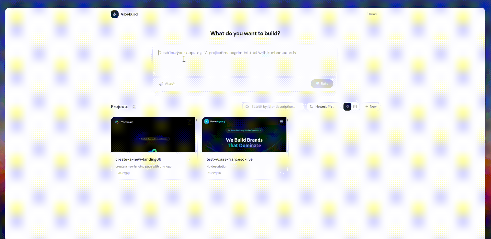

<div align="center">

# 🪄 Open-Source AI App Builder

### Turn a prompt into a full-stack **Next.js** web app — with hosting, sandbox, database, auth, AI, GitHub sync, multitenancy & custom domains built in.

**A free, self-hosted, white-label alternative to [v0](https://v0.dev), [Lovable](https://lovable.dev), [Bolt](https://bolt.new) and [Replit](https://replit.com).**
Run it yourself, or drop a first-class AI app builder straight into your own SaaS.

<br/>

[](https://nextjs.org)
[](https://react.dev)
[](https://www.typescriptlang.org)
[](https://tailwindcss.com)
[](#-license)
[](#-contributing)

[**🚀 Quick Start**](#-quick-start) · [**🧩 Embed in your SaaS**](#-embed-it-in-your-own-saas) · [**☁️ Deploy**](#️-deployment) · [**📚 Docs**](https://www.totalum.app/docs) · [**⭐ Star this repo**](https://github.com/totalumlabs/ai-app-builder-open)

<br/>



*From prompt to deployed full-stack app — live preview, code editor, database and deploy, all in one place.*

</div>

---

## What is this?

**AI App Builder Open** is an open-source, no-code AI app builder. A user types what they want — *"a CRM with kanban boards and Stripe billing"* — and the AI builds, previews, and deploys a real, full-stack **Next.js** application. Live preview, code editor, database, logs, versioning and GitHub sync are all included, out of the box.

It's powered by the **[Totalum VCaaS API](https://www.totalum.app/en/whitelabel)** (Vibe-Coding-as-a-Service), which handles the heavy backend infrastructure — hosting, sandboxes, databases, AI agents, custom domains and GitHub — behind **a single API key**. You bring the front-end (this repo, or your own SaaS); Totalum brings the platform.

> **In one sentence:** clone this repo, paste one API key, and you have your own AI app builder running in minutes — for yourself, or for your customers.

---

## 🌟 Why you'll want this

| For… | What you get |
| --- | --- |
| 🧑‍💻 **Builders & indie hackers** | Your own free, self-hosted v0 / Lovable / Bolt alternative. Prompt → deployed app. |
| 🏢 **SaaS & software companies** | Embed a **first-class AI app builder** into your new or existing product. Let *your* users build full-stack apps inside *your* app. |
| 🎨 **Agencies & no-code teams** | Ship client apps faster. White-label the whole experience. |
| 🧪 **Tinkerers & non-tech users** | No infrastructure to manage. One key, and everything just works. |

---

## ✨ Features

Everything below works with **one API key** — no separate cloud accounts, no glue code:

- 🤖 **Prompt → full-stack app** — describe an app in plain English, the AI agent builds a complete Next.js project.
- 👀 **Live preview** — see the running app update in real time as the agent works.
- 🧑‍💻 **Built-in code editor** — Monaco (VS Code) editor to read and inspect every generated file.
- 🗄️ **Managed database** — each app gets a real database; browse, query, and edit records in the UI.
- 🔐 **Secrets & env vars** — manage API keys and environment variables per project, per environment.
- 🚀 **One-click hosting & deploy** — every project gets a live URL; publish to production instantly.
- 🌐 **Custom domains** — attach your own domain with guided DNS setup.
- 🔗 **Bidirectional GitHub sync** — connect a repo and push/pull changes both ways.
- 🕓 **Version history** — every AI build is a restorable checkpoint; roll back anytime.
- 📜 **Live server logs** — inspect runtime logs from preview *and* production.
- 🧱 **Sandboxes** — each project runs in an isolated sandbox environment.
- 🏢 **Multitenant-ready** — spin up isolated projects per user or per customer, no extra work.
- 🎁 **Pretty git-diff viewer** — review exactly what the AI changed, file by file.
- 🌍 **Deploy anywhere** — Vercel, a container, or any Node.js host. Fully deployment-agnostic.

---

## 🚀 Quick Start

Get your own AI app builder running locally in **under 3 minutes**.

### 1. Clone & install

```bash
git clone https://github.com/totalumlabs/ai-app-builder-open.git
cd ai-app-builder-open
npm install
```

### 2. Add your API key

Create a `.env` (or `.env.local`) file in the project root:

```bash
TOTALUM_VCAAS_API_KEY=your_key_here
```

> 👉 Don't have a key yet? It's free to start — see [Getting your API key](#-getting-your-api-key) below.

### 3. Run it

```bash
npm run dev
```

Open **[http://localhost:3000](http://localhost:3000)**, type what you want to build, and watch the AI do the rest. 🎉

**Requirements:** [Node.js](https://nodejs.org) 20+ and npm. That's it.

---

## 🔑 Getting your API key

The **only** thing this app needs to run is a Totalum VCaaS API key. Getting one is quick and **the first 50 AI credits are free**:

1. **Create an account** at **[totalum.app/whitelabel](https://www.totalum.app/en/whitelabel)**.
2. During onboarding, choose the **"Use the Totalum API"** option.
3. **Copy your API key** and paste it into your `.env` file as `TOTALUM_VCAAS_API_KEY`.

That single key unlocks hosting, databases, AI, custom domains, GitHub sync and sandboxes — **no other providers required**. 📖 Full details in the **[Totalum Docs](https://www.totalum.app/docs)**.

---

## ⚙️ Environment variables

| Variable | Required | Description |
| --- | :---: | --- |
| `TOTALUM_VCAAS_API_KEY` | ✅ **Yes** | Your Totalum VCaaS API key — the only variable the app needs. Kept server-side only; never exposed to the browser. |
| `NEXT_PUBLIC_APP_URL` | ⬜ Optional | Public base URL of your deployment (e.g. `https://your-domain.com`). Used to allow-list your origin for CSP/CORS in production. Defaults to same-host. |

Copy the example file to get started:

```bash
cp .env.example .env.local
```

> 🔒 **Security:** the API key is read only on the server (`src/lib/vcaas.ts`) and is never bundled into client-side JavaScript. It is **not** a `NEXT_PUBLIC_` variable.

---

## ☁️ Deployment

This is a standard Next.js app with **no platform lock-in** — deploy it wherever Next.js runs.

### Deploy to Vercel (one click)

[](https://vercel.com/new/clone?repository-url=https://github.com/totalumlabs/ai-app-builder-open&env=TOTALUM_VCAAS_API_KEY)

Import the repo, set `TOTALUM_VCAAS_API_KEY` in **Environment Variables**, and deploy. No extra configuration.

### Deploy to any Node.js host (VM, container, Docker, Railway, Render…)

```bash
npm run build
npm start          # serves on $PORT (default 3000)
```

Set `TOTALUM_VCAAS_API_KEY` in your host's environment, point a process manager or container at `npm start`, and you're live. Works great behind Nginx, in Docker, on a VPS, or on any PaaS.

---

## 🧩 Embed it in your own SaaS

This is the part that makes AI App Builder Open special: **it's not just a standalone tool — it's a drop-in AI app-builder layer for your product.**

Whether you're launching something new or already have a live SaaS, you can offer your users a **first-class, in-product AI app builder** without building any of the infrastructure yourself:

- 🏢 **Multitenant by design** — every generated app is an isolated Totalum project. Create one per user, per team, or per customer and keep everything separated. No extra plumbing.
- 🎨 **White-label** — it's your codebase and your UI. Rebrand it, restyle it, and embed it inside your existing dashboard.
- 🔌 **One integration, full platform** — a single API key gives *your users* hosting, databases, AI, domains, GitHub and sandboxes. You don't stitch together five vendors.
- 📈 **Add a new revenue stream** — resell app-building, hosting or premium AI credits on top of your current product.

> **The pitch to your customers:** *"Build and ship a full-stack app right here, inside our platform."* — powered by this repo + Totalum, with no backend for you to operate.

Read the integration guide in the **[Totalum Docs → www.totalum.app/docs](https://www.totalum.app/docs)**.

---

## 🔐 Auth, database & third-party providers

The generated apps come with a managed database and everything they need to run. On top of that, **you're free to add any third-party provider you like** — nothing is locked down:

- **Auth** — plug in [Better Auth](https://better-auth.com) (already included as a dependency), [Supabase Auth](https://supabase.com/auth), Clerk, Auth0, or your own.
- **Database** — use the built-in database, or connect [Supabase](https://supabase.com), Postgres, PlanetScale, MongoDB, etc.
- **Payments** — [Stripe](https://stripe.com) is included out of the box for billing and subscriptions.
- **AI** — the [Vercel AI SDK](https://sdk.vercel.ai) is included; bring any model or provider.

Add a provider by dropping in its SDK and configuring a secret in the **Secrets** panel — no framework fighting required.

---

## 🏗️ How it works

```
┌──────────────────────────────────────────────────────────────┐
│  This repo (Next.js front-end / your SaaS)                    │
│                                                              │
│   UI components ──► vcaasApi (client catalog)                │
│                        │  same-origin fetch                  │
│                        ▼                                     │
│   /api/vcaas/*  (server proxy routes) ──► attaches api-key   │
└────────────────────────────┬─────────────────────────────────┘
                             │  HTTPS + secret API key
                             ▼
        ╔═══════════════════════════════════════════╗
        ║   Totalum VCaaS API                        ║
        ║   hosting · sandboxes · database · AI      ║
        ║   agents · GitHub · domains · multitenancy ║
        ╚═══════════════════════════════════════════╝
```

- The **browser never sees your API key.** Client code calls same-origin `/api/vcaas/*` proxy routes; the server attaches the credential and forwards the request to Totalum.
- **One service file** (`src/lib/vcaas.ts`) documents every Totalum endpoint the app uses — easy to read, extend, and audit.
- Totalum handles the hard parts (compute, storage, deploys, AI orchestration), so this repo stays a clean, hackable Next.js app.

---

## 🗂️ Project structure

```
src/
├─ app/
│  ├─ page.tsx                 # Dashboard — prompt box + your projects
│  ├─ project/[projectId]/     # The workspace (chat, preview, code, DB, …)
│  └─ api/
│     ├─ vcaas/[...path]/      # Proxy to the Totalum VCaaS API
│     └─ config/               # Reports whether the API key is configured
├─ components/
│  └─ workspace/               # Chat, Preview, Code, Database, GitHub, Logs…
├─ lib/
│  ├─ vcaas.ts                 # 🧠 The single VCaaS service (client + server)
│  └─ vcaas-types.ts           # Shared API types
└─ proxy.ts                    # CORS / CSP boundary
```

---

## ❓ FAQ

<details>
<summary><b>Is it really free?</b></summary>

The code is free and open source. Running it needs a Totalum API key, which is **free to start** (your first 50 AI credits are on the house). You only pay as you scale usage. See [pricing on totalum.app](https://www.totalum.app/en/whitelabel#pricing).
</details>

<details>
<summary><b>Do I need to set up a database, hosting, or AI provider?</b></summary>

No. That's the whole point — the single Totalum API key provides hosting, databases, AI, domains, GitHub and sandboxes. You can still add your own providers (Supabase, Stripe, etc.) if you want.
</details>

<details>
<summary><b>Can my users build apps inside my own product?</b></summary>

Yes. It's multitenant and white-label by design — see [Embed it in your own SaaS](#-embed-it-in-your-own-saas).
</details>

<details>
<summary><b>What can it build?</b></summary>

Full-stack Next.js web apps — dashboards, CRMs, internal tools, marketplaces, SaaS MVPs, landing pages with backends, and more.
</details>

<details>
<summary><b>Where's the API key stored? Is it safe?</b></summary>

Server-side only. It's read in `src/lib/vcaas.ts` and never shipped to the browser (it's not a `NEXT_PUBLIC_` variable). Client requests go through same-origin proxy routes.
</details>

<details>
<summary><b>Can I self-host without Vercel?</b></summary>

Absolutely. `npm run build && npm start` runs on any Node.js host — VM, container, Docker, Railway, Render, Fly.io, etc.
</details>

---

## 🆚 How it compares

| | **AI App Builder Open** | v0 · Lovable · Bolt · Replit |
| --- | :---: | :---: |
| Open source | ✅ | ❌ |
| Self-hostable | ✅ | ❌ |
| White-label / embeddable in your SaaS | ✅ | ❌ |
| Multitenant out of the box | ✅ | Limited |
| Built-in hosting + DB + domains + GitHub | ✅ (one key) | Varies |
| Bring your own providers (Supabase, Stripe…) | ✅ | Limited |
| Deploy anywhere | ✅ | ❌ |

---

## 📚 Documentation

Full platform documentation, API reference, and integration guides live at:

### 👉 **[www.totalum.app/docs](https://www.totalum.app/docs)**

---

## 🤝 Contributing

Contributions are welcome! Whether it's a bug fix, a new panel, docs, or a feature idea:

1. Fork the repo and create a branch: `git checkout -b my-feature`
2. Make your changes and run `npm run build` to verify.
3. Open a pull request describing what and why.

Found a bug or have an idea? [Open an issue](https://github.com/totalumlabs/ai-app-builder-open/issues).

---

## 📄 License

Released under the **MIT License** — free for personal and commercial use. See the [`LICENSE`](LICENSE) file for details.

---

<div align="center">

### If this project helps you, please give it a ⭐ — it helps others discover it.

**Open-source AI app builder** · self-hosted **v0 / Lovable / Bolt / Replit alternative** · prompt-to-app · full-stack Next.js · multitenant · embeddable AI app builder for your SaaS.

Built with ❤️ on top of the [Totalum VCaaS API](https://www.totalum.app/en/whitelabel) · [Docs](https://www.totalum.app/docs) · [Get your free API key](https://www.totalum.app/en/whitelabel)

</div>
